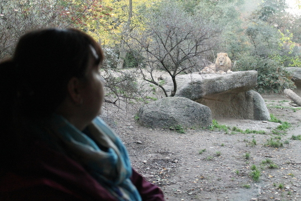
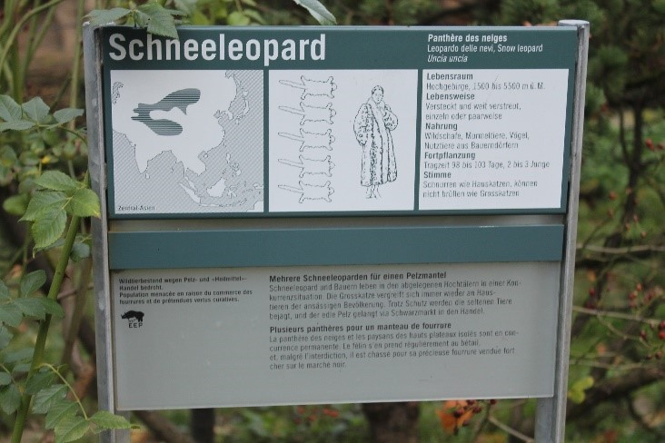
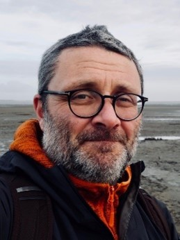
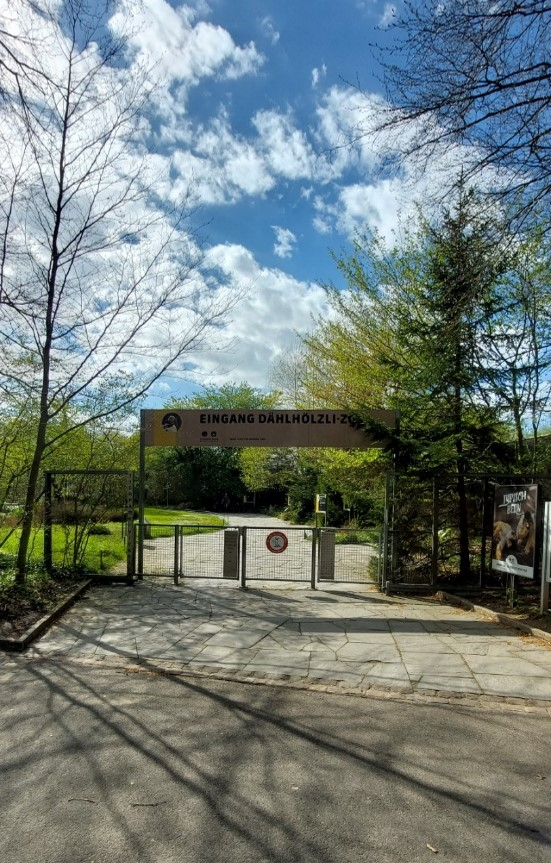

+++
title = "Mit gutem Gewissen in den Zoo? 5"
date = "2023-06-12"
draft = true
pinned = false
tags = ["Deutsch", "Reportage"]
image = "1.jpg"
description = ""
+++

Es ist ein frischer Samstagmorgen, die Sonne scheint und die Kinder rennen hin und her und bleiben ab und zu stehen. Die Eltern lassen ihnen alle Freiheiten, um sich auszutoben, denn Autos und andere gefährliche Dinge gibt es hier im Tierpark nicht. Ein Kind bleibt vor dem Affengehege stehen, es schaut dem Schimpansen Rick beim Essen zu und klopft an die Scheibe, in der Hoffnung eine Reaktion auf die Aktion zu erhalten. Doch im Gegenteil, Rick dreht sich mit dem Rücken zum Kind und keine sieben Sekunden später rennt das Kind weiter zum nächsten Gehege. Am Abend wird es mit zahlreichen Erlebnissen den Tierpark hinter sich lassen und mit seiner Familie nach Hause gehen. Doch Rick wird sitzen bleiben und sein Zuhause nennt sich eine 400 Quadratmeter grosse Anlage mit etwas Grün und ein paar gespannten Seilen, an denen er sich mit seinen drei Mitbewohnern entlang hangeln kann. Von den weiten Flachlandregenwäldern Afrikas kann er nur träumen, falls er überhaupt weiss, wie sein ursprünglicher Lebensraum aussieht. Ist es uns das wert, Tiere Tag für Tag einzusperren?

***Eine Reportage von Gabriele Scognamiglio und Sorin Schmassmann***



### Bemerkung

Kurz vor der Veröffentlichung der Reportage ist Frau Dr. von Houwald (Direktorin des Tierpark Berns), einer unser Interviewpartner abgesprungen. Es wurden alle Passagen von ihr gestrichen und durch neue ersetzt. So findet sich in der Reportage nur noch Herr Prof. Dr. Wild als Interview Partner und Fachperson.

``

### Was sind Zoos?

In früheren Zeiten stand das Erlebnis, exotische Tiere zu sehen, im Mittelpunkt. Sehr viele Tiere auf engem Raum waren also keine Seltenheit. Doch inwiefern unterscheidet sich der Zoo von heute davon? Genau beantworten kann man das nicht, Denn es gibt nicht *den* Zoo, da dies kein rechtlich geschützter Begriff ist. Das heisst, dass jeder sich Zoo nennen darf, solange er ein paar Tiere hat und die nötigen Qualifikationen und sonstige Voraussetzungen vorweisen kann, um diese zu halten. Es gibt aber verschiedene Dachverbände wie die EAZA (European Association of Zoos and Aquaria) und WAZA (World Association of Zoos and Aquariums), in denen die Zoos gewisse Voraussetzungen und Anforderungen erfüllen müssen, um Mitglied dieser Organisationen zu sein. In der Schweiz haben wir etwas über 50 Zoos und Tierparks und weltweit sind es wohl schätzungsweise an die 10 000. So veränderten sich die Zoos im Wandel der Gesellschaft und setzten sich neue Schwerpunkte: Bildung und Erholung für die Bevölkerung, Forschung und Artenschutz.

## Die vier Schwerpunkte

### Bildung

Die meisten Leute bleiben nur kurz vor einem Gehege stehen und die wenigsten lesen die informativen Schilder. Wenn das so abläuft, wie soll der Zoo dann Leute bilden? Bei diesem Dilemma kann man nicht einfach so die ganze Verantwortung dem Zoo zuschieben. Denn der Besucher ist auch am Prozess der Bildung beteiligt, wenn auch nicht bei der Vermittlung, sondern bei der Aufnahme des Vermittelten. Der Besucher muss die Bereitschaft zeigen auch etwas lernen zu wollen und die Geduld dafür aufzubringen.  Es ist wie an der Universität, der Professor kann sich noch so Mühe geben etwas zu erklären, solange der Student nicht motiviert ist etwas mitzunehmen, lernt dieser auch nichts. Man muss aber den Zoos zugutehalten, dass sie mehr denn je Führungen für interessierte Besucher anbieten, durch welche diese tatsächlich auch etwas dazulernen. Und die oft unbeachteten Schilder mit den Steckbriefen der Tiere werden immer mehr mit interaktiven Elementen ergänzt, je nach Zielgruppe, ob Touchscreens, Quiz-Tafeln mit aufklappbaren Antworten oder Druckknöpfe, die dann die Geräusche des Tieres abspielen lassen. Jedoch sind diese interaktiven Elemente erst im Kommen. Das bedeutet: Das Ziel des Zoos «zu bilden», ist nicht sehr erfolgreich umgesetzt. So gibt es laut Herrn Wild kaum Studien, die sich für Zoos aussprechen: *«Ich glaube nicht, dass es solche Studien gibt. Es gibt einige Studien, die sind entweder negativ oder sie sind von Zoos in Auftrag gegeben oder sie sind unbestimmt, was das Resultat betrifft. Deshalb glaube ich, das mit der Bildung ist momentan eher eine Ideologie als eine Tatsache, aber viele Leute glauben diese Ideologie.»* Dabei muss man sich aber auch fragen, ob die damit erreichte Bildung in einem vernünftigen Verhältnis zum Tierwohl steht. Fakt ist, dass Personen, die von ihren persönlichen Erlebnissen mit Tieren erzählen oder Naturdokumentationen ebenso gut bilden und Emotionen erzeugen

### Erholung

Wie sieht Erholung im Zoo aus? Nun, einige Personen können sich sicher durch das Beobachten der Tiere vom Alltagsstress etwas ablenken und so Erholung finden. Für andere, wie zum Beispiel Familien mit Kindern, kann es ein Tagesausflug mit anschliessendem Picknick sein, bei dem die Eltern den Kindern freien Lauf lassen und sich diese auf dem Gelände austoben können, sei es bei der Seehundfütterung oder auf dem Spielplatz direkt in Sichtweite der Picknickstelle. Dem gegenüber stellt Robert Marc Lehmann fest: 

> «Mit Kindern in den Wald, an den Fluss oder auf die Wiese gehen, anstatt in den Zoo» (Zitat, Seite 361, Mission Erde, Die Welt ist es wert, um sie zu kämpfen, Verlag Ludwig).

### Forschung

Die Zucht kann tatsächlich ein Argument sein. Je nach Land ist das unterschiedlich. Es gibt einige Länder mit intensiver Zooforschung wie zum Beispiel die USA, England oder die Niederlande. Ein sehr gutes Beispiel ist der Zoo Leipzig, dieser hat als einziger Zoo in Europa alle grossen Menschenaffen, also die Schimpansen, Gorillas, Bonobos und Orang-Utans. In Leipzig befindet sich ebenfalls das Max-Planck-Institut für evolutionäre Anthropologie, welches seit über 20 Jahren im Projekt «Pongoland» mit dem Zoo Leipzig zusammenarbeitet. Und dann gibt es laut Herr Prof. Dr. Wild richtig gute Forschung. Das ist aber die Ausnahme, dass es so gut funktioniert wie in Leipzig. Eine solche Zusammenarbeit in der Forschung kann auch besser sein, als die Forschung in der freien Natur. So ist in der Natur nicht kontrollierbar, was die Tiere beeinflusst und es ausserdem immer schwieriger wird, die Tiere nicht zu stark an den Menschen zu gewöhnen oder sie gar zu stören. Allerdings sind fast alle Studien über das Verhalten der Tiere schon dadurch verfälscht, dass die Tiere eingesperrt sind. Auch könnte all diese Forschung direkt vor Ort gemacht werden, wo die Tiere in geschützten Parks viel freier und in ihrem natürlichen Lebensraum leben könnten. Ein weiterer Punkt, der für diese Art der Forschung spricht, ist, dass man viele Dinge gar nicht im Zoo beobachten kann, weil diese nur in der freien Wildbahn stattfinden. Herr Prof. Dr. Wild fasst es folgendermassen zusammen: 

> «Für die Wissenschaft gibt es schon ziemlich gute Institutionen und man sollte diese nicht künstlich vervielfältigen».

### Artenschutz

Der Artenschutz besteht darin, im Zoo eine Reservepopulation aufzubauen. Dafür gibt es die Zuchtprogramme, in welchen koordiniert wird, von welchem Tier es wie viele braucht und wer mit wem verträglich ist. So, und jetzt angenommen, alle Verwandten von Rick sterben in der freien Natur aus. Welche Art hat man dann noch? Man hat das genetische Material der Art, aber man hat nicht die Art in der natürlichen Umgebung. Ein Tier ist ja nicht nur genetisches Material, es ist eine Art, welche in einer bestimmten Umgebung lebt. Das heisst, man hat dann irgendwann in Zoos wahrscheinlich ganz andere Tiere als jetzt in freier Wildbahn. Das kann man jetzt sehr gut am Beispiel der Füchse sehen. Die Füchse, welche in der Stadt wohnen, entwickeln sich anders als die Füchse, die im Wald wohnen, so werden ihre Ohren und ihr Gehirn kleiner. Die Füchse der Stadt haben also eine andere Evolution. Wie gross die Veränderungen sein werden, das werden wir dann wohl in 100 Jahren sehen. Man könnte aber auch den Artenschutz vor Ort betreiben, das wäre schon allein wegen des Transports einfacher. Man muss aber den Zoos zugutehalten, dass diese teilweise mit NGOS vor Ort zusammenarbeiten und sich auch daran finanziell beteiligen, wie zum Beispiel mit dem Naturschutzfranken. Frau Dr. von Houwald, welche diesen Naturschutzfranken ins Leben gerufen hat, erklärt, dass sich die Besucher beim Eintrittspreis dazu entscheiden können, einen freiwilligen Franken zu zahlen, um damit diverse Projekte zu unterstützen. Ein weiterer wichtiger Faktor ist, dass der Lebensraum dort bereits besteht und nicht künstlich nachgebaut werden muss. Da steht auch die Faktenlage eher gegen Zoos, von 8700 Arten sind 900 stark bedroht und maximal 68 Arten wurden tatsächlich von Zoos gerettet. Da die ersten beiden Zahlen nur AZA-Zoos (Association of Zoos and Aquariums) betreffen, welche 250 von schätzungsweise 10'000 Zoos und Aquarien sind, können diese beiden Zahlen auch höher sein. Laut Herrn Wild ist es auch sehr viel wichtiger, den Lebensraum zu schützen als eine eigene Art. Da man im Zoo schlecht den Lebensraum schützen kann, muss man dafür vor Ort Naturschutzgebiete errichten.



#### Herr Prof. Dr. Wild

Herr Prof. Dr. Wild ist Professor für theoretische Philosophie an der Universität Basel. Er hat sich unter anderem auf Tierphilosophie spezialisiert und arbeitet mit Sentience der Organisation für Tierrechte zusammen. Während dem ganzen Interview hat er einen informierten und vorbereiteten Eindruck hinterlassen. Sehr ausführlich hat er unsere Fragen beantwortet.

``

### Wie werden sich Zoos entwickeln? In Artenschutzzentren?

Mit Mottos wie: *«Mehr Platz für Diversität», «Erleben, was es zu bewahren gilt», «Tiere erfahren. Biodiversität bewahren»* gehen Schweizer Zoos jetzt mehr in Richtung Artenvielfalt und Artenschutz. Es gibt viele Projekte, welche Zoos für die Artenvielfalt und den Artenschutz unternehmen. Da wären einmal die offensichtlichen Unternehmung wie z.B. die Wiederansiedlung des Atlantischen Lachses im Rhein. Es gibt aber auch Dinge, welche auf den ersten Blick für Besucher gar nicht auffallen wie zum Beispiel eine Kieswiese in der Zooanlage, welche einem Bienenvolk als zu Hause dient. So wollen Zoos neuen Lebensraum schaffen, besonders für die, die sich ausserhalb unserer Wahrnehmung befinden.

> «Ich glaube es wäre gut langsam aus dem Zooprogramm auszusteigen, wie es der Zoo Barcelona tut,» erläutert Prof. Dr. Wild.

Als erster und heute noch einziger Zoo hat dieser 2019 beschlossen und damit angefangen, Tiere, die man nicht mehr auswildern kann, in Sanctuaries umzusiedeln. Der Zoo Barcelona hält und züchtet nur noch solche Tiere, welche auch wieder ausgewildert werden können. Er konzentriert sich nun eindeutig auf den Artenschutz und nicht auf das «Ausstellen von Tieren».

### Fazit

Als wir uns in das Thema, zugegeben etwas mit Vorurteilen behaftet, eingearbeitet haben, sind wir über viele Argumente für und gegen Zoos gekommen. Zoos bilden, schützen und forschen, jedoch ist die Weiterbildung der Besucher gemäss den meisten unabhängigen Studien zufolge vernachlässigbar und das Schützen und Forschen kann in anderen Institutionen besser praktiziert werden. Nun stellt sich also die Frage nach dem Gesamtaufwand für Betrieb und Unterhalt der Zoos und ob wir denken, dass es moralisch vertretbar ist, in Zoos zu gehen. Ist es uns das bisschen Bildung, die Forschung und das bisschen Artenschutz wert, Rick den Schimpansen, welcher sichtbar darunter leidet, einzusperren? Wir finden, diese Gegenargumente überwiegen die befürwortenden Argumente klar. Jedoch sollte jeder diese Fragen für sich selbst beantworten. Beispielsweise ob es in Ordnung ist, Fleisch und andere tierische Produkte zu essen.

